<div align="center">



<br/>

<a href="https://github.com/BhanuPrasad-2006"></a>


<a href="https://www.linkedin.com/in/bhanuprasad-gulivindala-26751432a/"></a>


</div>


## `> whoami`

<div align="center">

</div>

<br/>

I'm a **Computer Science & Cyber Security** student at **Dayananda Sagar College of Engineering, Bengaluru**. I like building systems that hold up under attack — and taking apart ones that don't. I work where **security meets computer vision** — face-verified voting with liveness anti-spoofing, and AI face search over recovered CCTV footage. Right now I'm deep in **digital forensics** for **Smart India Hackathon 2026**, pulling deleted surveillance video off raw DVR/NVR disks.


## `> ls ./projects --featured`

<div align="center">

<a href="https://github.com/BhanuPrasad-2006/sih-26150"></a>
<a href="https://github.com/BhanuPrasad-2006/online-college-electoral-system"></a>
<a href="https://github.com/BhanuPrasad-2006/vaultcore"></a>
<a href="https://github.com/BhanuPrasad-2006/Hospital-management-mini-project"></a>

<sub>click a card to open the repo</sub>

</div>


## `> cat arsenal.conf`

<table>
<tr><td><b><code>[languages]</code></b></td><td>


</td></tr>
<tr><td><b><code>[security]</code></b></td><td>


</td></tr>
<tr><td><b><code>[web]</code></b></td><td>


</td></tr>
<tr><td><b><code>[data · infra]</code></b></td><td>


</td></tr>
<tr><td><b><code>[biometrics · vision]</code></b></td><td>


</td></tr>
<tr><td><b><code>[ml · media]</code></b></td><td>


</td></tr>
</table>


## `> ./scan --activity`

<div align="center">


<picture>
  <source media="(prefers-color-scheme: dark)" srcset="https://raw.githubusercontent.com/BhanuPrasad-2006/BhanuPrasad-2006/output/snake-dark.svg"/>
  <source media="(prefers-color-scheme: light)" srcset="https://raw.githubusercontent.com/BhanuPrasad-2006/BhanuPrasad-2006/output/snake-light.svg"/>
  
</picture>

</div>


## `> cat interests.txt`

```yaml
security:   [digital-forensics, biometrics, face-recognition, fraud-detection, secure-auth, CTFs]
math:       [graph-theory, algorithms, discrete-mathematics]
currently:  "recovering deleted CCTV footage from raw recorder disks — SIH26150"
motto:      "Build it secure. Then try to break it."
```

<div align="center">

<br/>


## `> ./connect --secure`

<a href="https://www.linkedin.com/in/bhanuprasad-gulivindala-26751432a/"></a>
<a href="https://github.com/BhanuPrasad-2006?tab=repositories"></a>

<sub><code>// session closed · stay curious · stay secure</code></sub>

</div>
